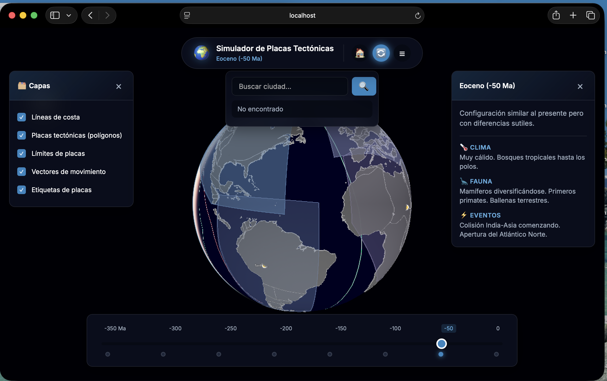

# 🌍 Simulador de Placas Tectónicas



> **Explora la Tierra desde Pangea hasta el presente** con datos geológicos reales y visualización 3D interactiva.

Aplicación web interactiva para explorar la geografía de la Tierra a lo largo del tiempo geológico. Utiliza **Cesium.js** para mostrar un globo terráqueo 3D realista con imágenes satelitales de la NASA y datos de reconstrucción de placas de GPlates.

---

## ✨ Características Principales

- **🌐 Globo 3D Realista** - Imágenes satelitales de alta resolución de la NASA/USGS
- **⏰ Viaje en el Tiempo** - Desde -350 Ma (Pangea Primitiva) hasta el Presente
- **🔴 Placas Tectónicas** - Visualización de dorsales, fosas y fallas con datos científicos
- **📍 Búsqueda de Ubicaciones** - Encuentra ciudades y su posición histórica
- **🏃 Vectores de Movimiento** - Dirección y velocidad de las placas en tiempo real
- **📚 Información Educativa** - Clima, fauna, flora y eventos de cada era

---

## 🚀 Demo en Vivo

Abre el archivo `web/index.html` en cualquier servidor web local:

```bash
cd web
python3 -m http.server 8000
```

Luego visita: **http://localhost:8000**

---

## 🛠️ Tecnologías

| Tecnología | Uso |
|------------|-----|
| [Cesium.js](https://cesium.com/) | Globo 3D con imágenes satelitales |
| [GPlates Web Service](https://gws.gplates.org/) | Datos de reconstrucción de placas |
| HTML5/CSS3/ES6+ | Interfaz de usuario moderna |

---

## 📂 Estructura del Proyecto

```
Simulador-de-Placas-Tectonicas/
├── web/                      # Aplicación web principal
│   ├── index.html           # Página principal
│   ├── css/style.css        # Estilos
│   ├── js/app.js            # Lógica de Cesium
│   ├── js/data.js           # Datos geológicos
│   └── data/                # GeoJSON de continentes
│       ├── coastlines_present.json
│       ├── coastlines_50ma.json
│       ├── coastlines_100ma.json
│       ├── coastlines_150ma.json
│       ├── coastlines_200ma.json
│       ├── coastlines_250ma.json
│       ├── coastlines_300ma.json
│       └── coastlines_350ma_pangea.json
├── screenshot.png           # Captura del proyecto
├── start.sh                 # Script para iniciar (Mac/Linux)
├── start.bat                # Script para iniciar (Windows)
└── README.md                # Este archivo
```

---

## 🎮 Uso

### Controles del Globo

| Acción | Control |
|--------|---------|
| Rotar | Click izquierdo + arrastrar |
| Zoom | Rueda del ratón |
| Inclinar | Click derecho + arrastrar |
| Pan | Click medio + arrastrar |

### Línea de Tiempo Geológica

Arrastra el slider para viajar entre eras:

| Era | Tiempo | Descripción |
|-----|--------|-------------|
| 🌍 Pangea Primitiva | -350 Ma | Formación del supercontinente |
| 🌍 Pangea | -300 Ma | Todos los continentes unidos |
| 🌍 Pangea Tardía | -250 Ma | Comienzo de la fragmentación |
| 🦕 Jurásico | -200 Ma | Apertura del Atlántico |
| 🦕 Cretácico Medio | -150 Ma | Laurasia y Gondwana separados |
| 🦕 Cretácico Tardío | -100 Ma | Dinosaurios dominantes |
| 🐋 Eoceno | -50 Ma | Mamíferos diversificándose |
| 🏙️ Presente | 0 Ma | Configuración actual |

### Capas Disponibles

- ✅ **Líneas de costa** - Continentes reconstruidos con datos reales
- ✅ **Placas tectónicas** - Polígonos de las principales placas
- ✅ **Límites de placas** - Dorsales (verde), convergentes (rojo), transformantes (amarillo)
- ✅ **Vectores de movimiento** - Flechas de velocidad y dirección
- ✅ **Etiquetas** - Nombres de las placas tectónicas

---

## 🔬 Datos Científicos

Las posiciones continentales se basan en:

- **Modelos GPlates** - Reconstrucción de placas tectónicas ([gplates.org](https://www.gplates.org/))
- **USGS** - Datos geológicos y geofísicos
- **NASA** - Imágenes satelitales y datos de elevación
- **Müller et al. 2019** - Modelo de reconstrucción global

### Placas Tectónicas Incluidas

| Placa | Velocidad | Dirección |
|-------|-----------|-----------|
| 🟤 Norteamérica | 2.3 cm/año | Oeste-Suroeste |
| 🟢 Sudamérica | 3.0 cm/año | Oeste |
| 🟠 Euroasiática | 2.1 cm/año | Este |
| 🟢 África | 2.15 cm/año | Norte-Noreste |
| 🟡 India | 6.0 cm/año | Norte |
| 🟠 Australia | 6.0 cm/año | Noreste |
| ⚪ Antártica | 1.0 cm/año | Estacionaria |
| 🔵 Pacífico | 7.5 cm/año | Noroeste |

---

## 🌍 Ubicaciones Disponibles

- Madrid, España
- Nueva York, USA
- Tokio, Japón
- Sídney, Australia
- Ciudad de México
- Buenos Aires, Argentina
- El Cairo, Egipto
- Bogotá, Colombia
- Londres, UK
- Pekín, China
- Y 10 ciudades más...

---

## 🛠️ Desarrollo

### Requisitos

- Navegador web moderno (Chrome, Firefox, Safari, Edge)
- Conexión a internet (para Cesium.js CDN y datos)

### Servidor Local

Cualquier servidor estático funciona:

```bash
# Python 3
python -m http.server 8000

# Node.js
npx http-server

# PHP
php -S localhost:8000
```

O usa los scripts incluidos:

```bash
# Mac/Linux
./start.sh

# Windows
start.bat
```

---

## 📚 Notas Importantes

- Las posiciones continentales son **reconstrucciones científicas** basadas en modelos de placas
- Las velocidades son promedios geológicos (no anuales exactos)
- Los datos de límites de placas están simplificados para visualización
- Las proyecciones futuras son especulativas basadas en velocidades actuales

---

## 🐛 Solución de Problemas

**El globo aparece negro:**
- Verifica tu conexión a internet
- Asegúrate de usar un servidor web (no file://)

**Lentitud:**
- Reduce el zoom
- Desactiva capas innecesarias
- Usa un navegador actualizado

---

## 📄 Licencia

MIT License - Ver [LICENSE](LICENSE) para más detalles.

---

## 🙏 Créditos

- **CesiumJS** - [cesium.com](https://cesium.com/)
- **GPlates** - [gplates.org](https://www.gplates.org/)
- **NASA Blue Marble** - Imágenes satelitales
- **EarthByte Group** - Datos de reconstrucción de placas

---

<div align="center">

**Hecho con 🌍 para entusiastas de la geología y la programación.**

*[Ver demo en vivo](http://localhost:8000)*

</div>
